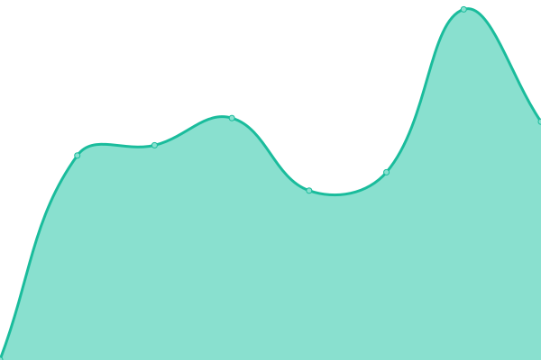

# [📈 Live Status](https://involve-gmbh.github.io/upptime): <!--live status--> **🟩 All systems operational**

This repository contains the open-source uptime monitor and status page for [involve marketing GmbH](www.involve.at), powered by [Upptime](https://github.com/upptime/upptime).

With [Upptime](https://upptime.js.org), you can get your own unlimited and free uptime monitor and status page, powered entirely by a GitHub repository. We use [Issues](https://github.com/involve-gmbh/upptime/issues) as incident reports, [Actions](https://github.com/involve-gmbh/upptime/actions) as uptime monitors, and [Pages](https://involve-gmbh.github.io/upptime) for the status page.

<!--start: status pages-->
<!-- This summary is generated by Upptime (https://github.com/upptime/upptime) -->
<!-- Do not edit this manually, your changes will be overwritten -->
<!-- prettier-ignore -->
| URL | Status | History | Response Time | Uptime |
| --- | ------ | ------- | ------------- | ------ |
|  [Homepage](https://involve.at) | 🟩 Up | [homepage.yml](https://github.com/involve-gmbh/upptime/commits/HEAD/history/homepage.yml) | 

 1007ms
     
 | 

<a href="https://involve-gmbh.github.io/upptime/history/homepage">100.00%</a>
    

|  [SharePic](https://sharepic.eu) | 🟩 Up | [share-pic.yml](https://github.com/involve-gmbh/upptime/commits/HEAD/history/share-pic.yml) | 

 978ms
     
 | 

<a href="https://involve-gmbh.github.io/upptime/history/share-pic">100.00%</a>
    

|  [Erema Group](https://erema-group.com) | 🟩 Up | [erema-group.yml](https://github.com/involve-gmbh/upptime/commits/HEAD/history/erema-group.yml) | 

 1162ms
     
 | 

<a href="https://involve-gmbh.github.io/upptime/history/erema-group">100.00%</a>
    

|  [Primeconcept](https://primeconcept.at) | 🟩 Up | [primeconcept.yml](https://github.com/involve-gmbh/upptime/commits/HEAD/history/primeconcept.yml) | 

 945ms
     
 | 

<a href="https://involve-gmbh.github.io/upptime/history/primeconcept">100.00%</a>
    

|  [Grötzmeier](https://groetzmeier.at) | 🟩 Up | [groetzmeier.yml](https://github.com/involve-gmbh/upptime/commits/HEAD/history/groetzmeier.yml) | 

 1023ms
     
 | 

<a href="https://involve-gmbh.github.io/upptime/history/groetzmeier">100.00%</a>
    

<!--end: status pages-->

[**Visit our status website →**](https://involve-gmbh.github.io/upptime)

## 📄 License

- Powered by: [Upptime](https://github.com/upptime/upptime)
- Code: [MIT](./LICENSE) © [involve marketing GmbH](www.involve.at)
- Data in the `./history` directory: [Open Database License](https://opendatacommons.org/licenses/odbl/1-0/)
